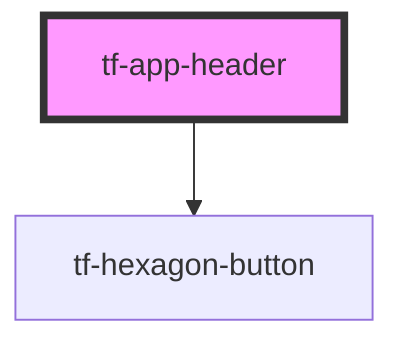

# tf-app-header

<!-- Auto Generated Below -->

## Properties

| Property           | Attribute            | Description | Type     | Default     |
| ------------------ | -------------------- | ----------- | -------- | ----------- |
| `appInitials`      | `app-initials`       |             | `string` | `undefined` |
| `appTitle`         | `app-title`          |             | `string` | `undefined` |
| `clientLogoSource` | `client-logo-source` |             | `string` | `undefined` |

## Events

| Event              | Description | Type                  |
| ------------------ | ----------- | --------------------- |
| `tfAppLogoClicked` |             | `CustomEvent<string>` |

## Dependencies

### Depends on

- [tf-hexagon-button](../hexagon-button)

### Graph

----------------------------------------------

*Built with [StencilJS](https://stenciljs.com/)*
