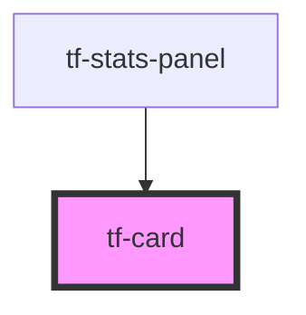

# tf-card

<!-- Auto Generated Below -->

## Properties

| Property | Attribute | Description | Type     | Default     |
| -------- | --------- | ----------- | -------- | ----------- |
| `colour` | `colour`  |             | `string` | `'default'` |

## Dependencies

### Used by

 - [tf-stats-panel](../stats)

### Graph

----------------------------------------------

*Built with [StencilJS](https://stenciljs.com/)*
