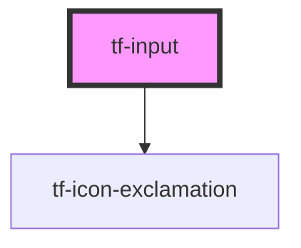

# tf-input

<!-- Auto Generated Below -->

## Properties

| Property       | Attribute       | Description | Type      | Default |
| -------------- | --------------- | ----------- | --------- | ------- |
| `error`        | `error`         |             | `boolean` | `false` |
| `hideLabel`    | `hide-label`    |             | `boolean` | `false` |
| `icon`         | `icon`          |             | `string`  | `null`  |
| `iconPosition` | `icon-position` |             | `string`  | `null`  |
| `inputError`   | `input-error`   |             | `string`  | `null`  |
| `inputHint`    | `input-hint`    |             | `string`  | `null`  |
| `label`        | `label`         |             | `string`  | `null`  |
| `name`         | `name`          |             | `string`  | `null`  |
| `placeholder`  | `placeholder`   |             | `string`  | `''`    |

## Dependencies

### Depends on

- [tf-icon-exclamation](../icons)

### Graph

----------------------------------------------

*Built with [StencilJS](https://stenciljs.com/)*
