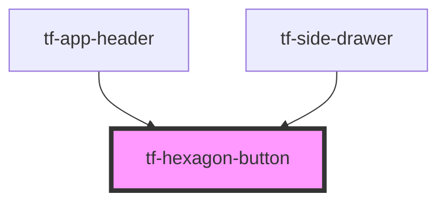

# tf-hexagon-button

<!-- Auto Generated Below -->

## Properties

| Property | Attribute | Description | Type     | Default    |
| -------- | --------- | ----------- | -------- | ---------- |
| `color`  | `color`   |             | `string` | `"accent"` |

## Dependencies

### Used by

 - [tf-app-header](../app-header)
 - [tf-side-drawer](../side-drawer)

### Graph

----------------------------------------------

*Built with [StencilJS](https://stenciljs.com/)*
