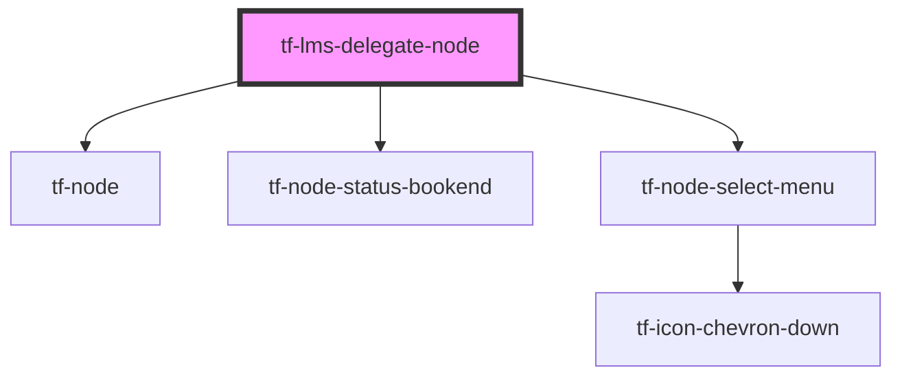

# tf-lms-delegate-node

<!-- Auto Generated Below -->

## Properties

| Property               | Attribute                | Description | Type     | Default     |
| ---------------------- | ------------------------ | ----------- | -------- | ----------- |
| `courseCode`           | `course-code`            |             | `string` | `"-"`       |
| `courseTitle`          | `course-title`           |             | `string` | `"-"`       |
| `delegateCoursesCount` | `delegate-courses-count` |             | `number` | `undefined` |
| `delegateDob`          | `delegate-dob`           |             | `string` | `"-"`       |
| `delegateId`           | `delegate-id`            |             | `string` | `"-"`       |
| `delegateName`         | `delegate-name`          |             | `string` | `"-"`       |
| `delegateStatus`       | `delegate-status`        |             | `string` | `"none"`    |

## Dependencies

### Depends on

- [tf-node](../nodes)
- [tf-node-status-bookend](../node-status-bookend)
- [tf-node-select-menu](../node-select-menu)

### Graph

----------------------------------------------

*Built with [StencilJS](https://stenciljs.com/)*
