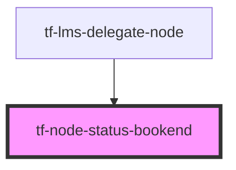

# tf-node-status-bookend

<!-- Auto Generated Below -->

## Properties

| Property      | Attribute      | Description | Type      | Default     |
| ------------- | -------------- | ----------- | --------- | ----------- |
| `color`       | `color`        |             | `string`  | `"grey"`    |
| `showTooltip` | `show-tooltip` |             | `boolean` | `undefined` |

## Dependencies

### Used by

 - [tf-lms-delegate-node](../lms-delegate-node)

### Graph

----------------------------------------------

*Built with [StencilJS](https://stenciljs.com/)*
