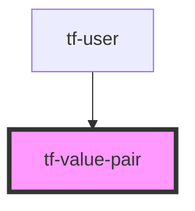

# tf-value-pair

<!-- Auto Generated Below -->

## Dependencies

### Used by

 - [tf-user]()

### Graph

----------------------------------------------

*Built with [StencilJS](https://stenciljs.com/)*
